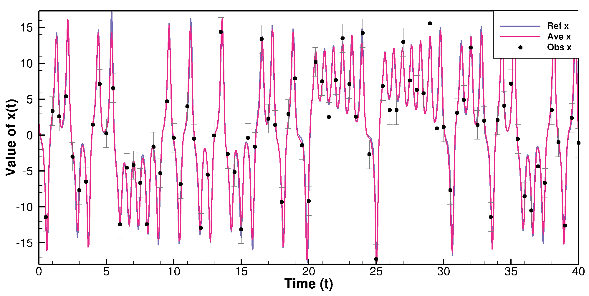
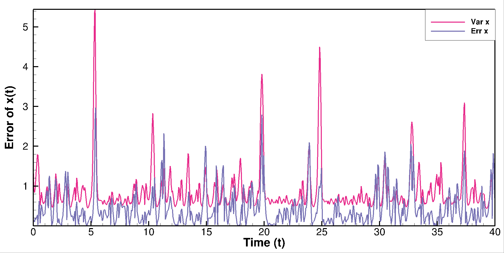

# EnKF_lorenz

EnKF, EnKS, and ES implementation with lorenz'63 equations as used in Evensen (1997, 2000, 2009ab).
The code allows for testing various EnKF schemes with highly nonlinear dynamics.

Evensen, G. Advanced data assimilation for strongly nonlinear dynamics.
Mon. Weather Rev., 125: 1342-1354, 1997. 
<a href="https://doi.org/10.1175/1520-0493(1997)125%3C1342:ADAFSN%3E2.0.CO;2">doi:10.1175/1520-0493(1997)125%3C1342:ADAFSN%3E2.0.CO;2</a>

Evensen, G. and P. J. van Leeuwen.  An ensemble Kalman smoother for nonlinear dynamics.
Mon. Weather Rev., 128:1852-1867, 2000. 
<a href="https://doi.org/10.1175/1520-0493(2000)128<1852:AEKSFN>2.0.CO;2">doi:10.1175/1520-0493(2000)128<1852:AEKSFN>2.0.CO;2</a>

Evensen, G. The ensemble Kalman filter for combined state and parameter estimation.
IEEE Control Systems Magazine, 29(3):83–104, 2009a. doi:
<a href="https://doi.org/10.1109/MCS.2009.932223">doi:10.1109/MCS.2009.932223</a>

Evensen, G. Data Assimilation: The Ensemble Kalman Filter. Springer, 2nd edition, 2009b.
<a href="https://doi.org/10.1007/978-3-642-03711-5">doi:10.1007/978-3-642-03711-5</a>


<p align="center">
 
</p>


# Installation:

## 1. Building the Project

If you plan to collaborate or contribute anything to the project, use the <a href="#1b-advanced-installation">Advanced Installation</a> option.

### 1a. Basic installation

Create a directory to clone the three following repositories:

```bash
git clone git@github.com:geirev/EnKF_lorenz.git
git clone git@github.com:geirev/EnKF_sampling.git
git clone git@github.com:geirev/EnKF_analysis.git
```

After cloning, the directory structure should look like:

```bash
.
├── EnKF_analysis
└── EnKF_sampling
└── EnKF_lorenz
```

### 1b. Advanced installation

Make a personal github account unless you already have one.
Fork the three repositorys listed above.
Next clone the repositories and set upstream to the original repositories where
you need to replace <userid> with your github userid

```bash
git clone git@github.com:<userid>/EnKF_lorenz.git
pushd EnKF_lorenz
git remote add upstream https://github.com/geirev/EnKF_lorenz
#or, if you have set up git-ssh
#git remote add upstream git://github.com:geirev/EnKF_lorenz
popd

git clone git@github.com:<userid>/EnKF_analysis.git
pushd EnKF_analysis
git remote add upstream https://github.com/geirev/EnKF_analysis
#or, if you have set up git-ssh
#git remote add upstream git://github.com:geirev/EnKF_analysis
popd

git clone git@github.com:<userid>/EnKF_sampling.git
pushd EnKF_sampling
git remote add upstream https://github.com/geirev/EnKF_sampling
#or, if you have set up git-ssh
#git remote add upstream git://github.com:geirev/EnKF_sampling
popd
```

If you are new to Git, read the section <a href="https://github.com/geirev/EnKF_seir#git-instructions">Git instructions</a>

## 2. Required Packages

### Linux

```bash
sudo apt-get update
sudo apt-get install libblas-dev liblapack-dev gfortran
```

### Mac

```bash
brew install gcc openblas lapack
```

**Note:** You must have [Homebrew](https://brew.sh/) installed to install
packages using `brew`

## 3. Compile the `EnKF_sampling` library

Navigate to the `lib` folder of the `EnKF_sampling` repository:

```bash
cd EnKF_sampling/lib
```

then compile and place all the `.o` files as well as `libanalysis.a` into
the `build` directory of the `EnKF_lorenz` repository using:

```bash
make BUILD=../../EnKF_lorenz/build
```

## 4. Compile the `EnKF_analysis` library

Navigate to the `lib` folder of the `EnKF_analysis` repository:

```bash
cd EnKF_analysis/lib
```

then compile and place all the `.o` files as well as `libanalysis.a` into the
`build` directory of the `EnKR_lorenz` repository using:

```bash
make BUILD=../../EnKF_lorenz/build
```

## 5. Compile the `EnKF_lorenz` library

### Linux

Navigate to the `src` folder of the `EnKF_lorenz` repository:

```bash
cd EnKF_lorenz/src
```

then compile and install the executable in the target directory, defaulting to
`$HOME/bin`:

```bash
make BINDIR=$HOME/bin
```

### Mac

Navigate to the `src` folder of the `EnKF_lorenz` repository:

```bash
cd EnKF_lorenz/src
```

then edit the following line in `EnKF_lorenz/src/makefile` from:

```bash
LIBS = ./libenkfanalysis.a -llapack -lblas -llapack 
```

to:

```bash
LIBS = ./libenkfanalysis.a -llapack -lblas -llapack 
```

then compile and install the executable in the target directory, defaulting to
`$HOME/bin`:

```bash
make BINDIR=$HOME/bin
```

## 6. Run the Project

### Linux

Navigate to the `run` directory of the `EnKF_lorenz` repository:

```bash
cd EnKF_lorenz/run
```

and run:

```bash
lorenz
```

### Mac

Create the `/usr/local/bin` directory which allows the `lorenz` command to be ran
from anywhere on the local file system:

```bash
mkdir -p /usr/local/bin
```

then create a symlink for `$HOME/bin/lorenz` to `/usr/local/bin`

```bash
ln -s $HOME/bin/lorenz /usr/local/bin/
```

then run the project:

```bash
cd EnKF_lorenz/run
lorenz
```

## 7. Plotting

If you have tecplot (tec360) there are `.lay` and `.mcr` files in the `run`
directory. Otherwise the output files can be plotted by any software like gnuplot etc.
